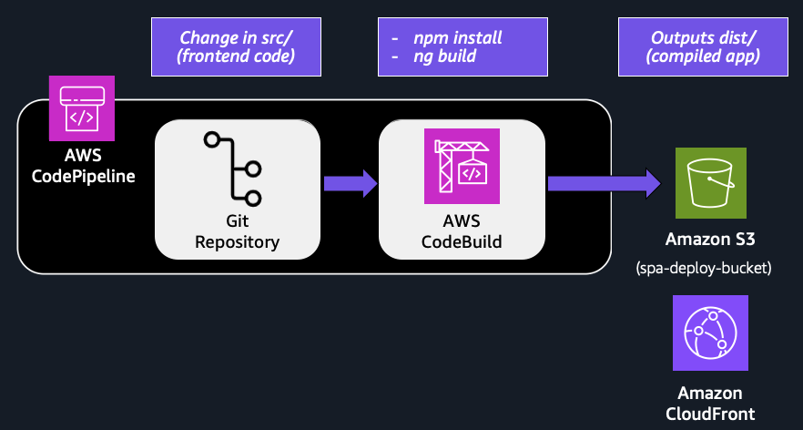

# Single Page Application (SPA) Deployments on Amazon S3 Using DevOps

This project showcases a modern, lightweight Single Page Application (SPA) architecture using Angular, integrated with a serverless backend powered by AWS Lambda, API Gateway, and DynamoDB, and deployed through a CI/CD pipeline using AWS CodePipeline and CodeBuild.

## Overview

The application allows users to:
- Submit a message to a backend API (stored in DynamoDB)
- Retrieve and display stored messages
- Navigate seamlessly across views using Angular's client-side routing
- Experience frontend updates without full page reloads

This project is designed to bridge the frontend-backend gap and highlight the inner workings of modern cloud-native SPAs.

## Project Structure
<pre>
aws-spa-demo/
├── frontend/
│   ├── src/           # SPA components, routing, UI logic
│   ├── angular.json
│   ├── ...
│   └── buildspec.yml  
│
├── backend/
│   ├── spa-sam-app/   # SAM template & Lambda functions
│   │   ├── get_items/
│   │   ├── put_items/
│   │   ├── ...
│   │   └── template.yaml
│   └── buildspec.yml
│
└── README.md
</pre>

## Deployment Workflow



### Frontend
- Code changes pushed to GitHub trigger CodePipeline
- CodeBuild runs ng build, syncs dist/ to S3, and invalidates CloudFront

### Backend
- Uses AWS SAM CLI to deploy Lambda, API Gateway, and DynamoDB
- API endpoints are injected into the Angular app for integration

## Technologies Used

- **Angular (Standalone Components)** – Modular SPA structure
- **Amazon S3 + CloudFront** – Static web hosting + CDN
- **API Gateway + Lambda** – RESTful backend using Python
- **Amazon DynamoDB** – Scalable NoSQL data store
- **AWS CodePipeline + CodeBuild** – CI/CD automation
- **AWS SAM** – Backend deployment via Infrastructure as Code

## Demo Highlights

- Interactive UI to submit and retrieve messages from a backend API (DynamoDB via API Gateway + Lambda)
- Angular Router used to enable seamless navigation between multiple views (Home, Messages, About)
- Preview of Angular lazy loading — routes are loaded on demand to reduce the initial bundle size
- Automated frontend deployment via CodePipeline showcasing real-time rollout of UI changes

## Prerequisites & Setup 


To run this project and its CI/CD pipelines, you'll need:

- [Node.js](https://nodejs.org/)
- [Angular CLI](https://angular.dev/tools/cli/setup-local)
- [AWS CLI](https://aws.amazon.com/cli/) + [AWS SAM CLI](https://docs.aws.amazon.com/serverless-application-model/latest/developerguide/install-sam-cli.html) (configured with AWS credentials)

⚠️ **Important:** While this repository focuses on the application code, the CI/CD infrastructure, deployment resources (e.g., S3 bucket, CloudFront distribution), and associated IAM policies must be set up separately. These resources can be created manually or defined using Infrastructure as Code (IaC) such as AWS CloudFormation or Terraform.

You must:
1. Create an S3 bucket to host the Angular SPA
2. Create a CloudFront distribution that serves content from the S3 bucket
3. Configure the S3 bucket policy to allow access from the CloudFront origin access identity (OAI) or origin access control (OAC)

In addition, for the CI/CD infrastructure:

4. Create two AWS CodePipeline pipelines:
    - One for changes to the frontend/ directory
    - One for changes to the backend/ directory
5. Create two AWS CodeBuild projects (frontend and backend), each configured to use the matching *buildspec.yml* file
6. Set appropriate IAM policies for each CodeBuild project: 
    - **Frontend CodeBuild project**:
        - *PutObject*, *GetObject*, *DeleteObject*, and *ListBucket* permissions to the target S3 deploy bucket
        - Permissions to invalidate CloudFront cache
    - **Backend CodeBuild project**:
        - Permissions to deploy all resources in the SAM template
7. For the frontend CodeBuild project, define the following environment variables:
    - **DISTRIBUTION_ID** (CloudFront Distribution ID)
    - **DEPLOY_BUCKET** (S3 bucket for hosting the SPA)
    - **API_URL** (API Gateway invoke URL for the deployed backend)

### Run frontend locally:
```bash
cd frontend
npm install
ng serve
```

### Deploy backend:
```bash
cd backend/spa-sam-app
sam build
sam deploy --guided
```
## Common Gotchas

### ⚠️ SPA Page Refresh Returns 403 Error

After the SPA loads, if you try to refresh the browser on a route like /about or /messages, CloudFront may return a *403 Forbidden* error. This happens because:

- SPAs rely on *client-side routing*.
- When the browser refreshes, it requests the full path (e.g., /about), but CloudFront looks for a physical file at that path in S3 — which doesn't exist.

### ✅ How to Fix It

Update your *CloudFront distribution* with a custom error response:

- Go to the *Error Pages* tab in your distribution settings.
- Add a new error response:
  - **HTTP Error Code:** 403
  - **Response Page Path:** /index.html
  - **HTTP Response Code:** 200

This tells CloudFront to serve index.html (the SPA entry point) for any 403 errors, allowing the Angular router to take over from there.

---
🙌 Author  

**Walid El Khatib**  
*Teacher by Day, Builder by Night*
